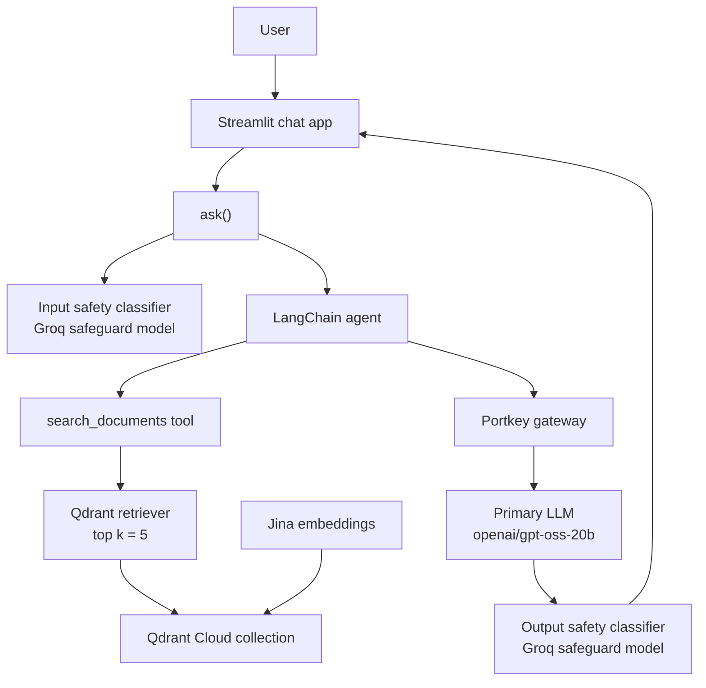

# HR Policy RAG Assistant

A Streamlit-based Retrieval-Augmented Generation (RAG) assistant that answers questions about an HR policy handbook. It retrieves relevant policy text from Qdrant Cloud, then uses a tool-enabled LangChain agent to generate grounded responses.

The project includes a demo HR policy document covering leave, work from home, probation, notice periods, reimbursements, conduct, holidays, and exit procedures.

## Features

- Natural-language HR policy questions through a Streamlit chat interface
- Text-document ingestion using LangChain’s `TextLoader`
- Recursive document chunking with configurable size and overlap
- Semantic embeddings using Jina AI
- Cloud vector search with Qdrant
- A LangChain agent that is instructed to search the policy document before answering
- Configurable top-`k` retrieval (`k=5` by default)
- Input and output policy-classification prompts using a Groq-hosted safeguard model
- Portkey gateway integration for the primary answering model and evaluation judge
- Structured application logging to the console and timestamped files
- Optional LangSmith tracing
- A ten-question evaluation dataset scored for correctness and groundedness with OpenEvals and LangSmith
- Docker support for running the Streamlit app

> **Important:** The included handbook is a demo document for Acme Corp, not a real company policy source.

## Architecture

The parse error comes from `ask()` inside the node label. Quote labels that include parentheses or HTML line breaks.

Replace the diagram with:



### Request flow

1. The application loads `data/hr_policy.txt`.
2. If the configured Qdrant collection does not exist, the text is split into chunks of 1,000 characters with 200-character overlap.
3. Each chunk is embedded with `jina-embeddings-v2-base-en` and stored in Qdrant.
4. A user asks a question through Streamlit or `main.py`.
5. The LangChain agent calls the `search_documents` tool to retrieve the five most relevant chunks.
6. The primary model, accessed through Portkey’s OpenAI-compatible gateway, uses the retrieved text to answer.
7. The application displays the final response and logs the run.

## Tech Stack

| Area | Technologies |
| --- | --- |
| UI | Streamlit |
| Agent framework | LangChain, LangChain Core, LangChain Community |
| LLM gateway | Portkey, LangChain OpenAI |
| Primary model | `openai/gpt-oss-20b` |
| Safety classifier | Groq / `openai/gpt-oss-safeguard-20b` |
| Embeddings | Jina AI / `jina-embeddings-v2-base-en` |
| Vector database | Qdrant Cloud, `langchain-qdrant`, `qdrant-client` |
| Evaluation | LangSmith, OpenEvals |
| Configuration | `python-dotenv` |
| Containerization | Docker, Python 3.11, uv |

## Project Structure

```text
HR-Policy-RAG-Assistant/
├── app.py                      # Streamlit chat interface
├── main.py                     # Command-line example entry point
├── evaluate.py                 # Runs the LangSmith evaluation workflow
├── requirements.txt            # Python dependencies
├── Dockerfile                  # Streamlit container image
├── rag.ipynb                   # Development notebook
├── data/
│   └── hr_policy.txt           # Demo Acme Corp HR handbook
├── hr_assistant/
│   ├── agent.py                # Creates the LangChain agent
│   ├── config.py               # Environment variables and settings
│   ├── document_loader.py      # Loads the policy text file
│   ├── splitter.py             # Splits documents into chunks
│   ├── embeddings.py           # Creates Jina embeddings
│   ├── vector_store.py         # Creates/loads Qdrant vector store
│   ├── tools.py                # Defines the document-search tool
│   ├── gateway.py              # Configures Portkey-backed LLMs
│   ├── llm.py                  # LLM factory helpers
│   ├── guardrails.py           # Input/output safety classification
│   ├── pipeline.py             # Assistant build and question flow
│   ├── evaluation.py           # Dataset and evaluator definitions
│   ├── tracing.py              # LangSmith tracing status helper
│   └── logger.py               # Console and file logging setup
└── logs/                       # Runtime logs
```

## Prerequisites

- Python 3.11 or newer
- A Qdrant Cloud cluster
- Jina AI API key
- Groq API key
- Portkey API key and configuration
- Optional: LangSmith account for tracing and evaluation

## Installation

```bash
git clone https://github.com/hardik020106/HR-Policy-RAG-Assistant.git
cd HR-Policy-RAG-Assistant

python -m venv .venv
```

Activate the environment:

```bash
# Windows PowerShell
.venv\Scripts\Activate.ps1

# macOS/Linux
source .venv/bin/activate
```

Install dependencies:

```bash
pip install -r requirements.txt
```

## Configuration

Create a `.env` file in the project root:

```dotenv
# Required by the current startup validation
GROQ_API_KEY=your_groq_api_key
JINA_API_KEY=your_jina_api_key

# Qdrant Cloud
QDRANT_URL=https://your-cluster-url
QDRANT_API_KEY=your_qdrant_api_key
QDRANT_COLLECTION_NAME=hr_policy_collection

# Portkey gateway
PORTKEY_API_KEY=your_portkey_api_key
PORTKEY_CONFIG=your_portkey_config

# Optional LangSmith tracing and evaluation
LANGSMITH_TRACING=false
LANGSMITH_ENDPOINT=https://api.smith.langchain.com
LANGSMITH_API_KEY=your_langsmith_api_key
LANGSMITH_PROJECT=Advanced RAG
```

The application uses these defaults from `hr_assistant/config.py`:

| Setting | Default |
| --- | --- |
| Policy source | `data/hr_policy.txt` |
| Chunk size | `1000` |
| Chunk overlap | `200` |
| Retrieved chunks | `5` |
| Primary model | `openai/gpt-oss-20b` |
| Embedding model | `jina-embeddings-v2-base-en` |
| Guard model | `openai/gpt-oss-safeguard-20b` |

## Run the App

Start the Streamlit interface:

```bash
streamlit run app.py
```

Then open the local address shown by Streamlit, normally `http://localhost:8501`.

Example questions:

```text
How many paid annual leave days do I get per year?
What is the notice period during probation?
How many days per week can I work from home?
When must reimbursement claims be submitted?
```

## Command-Line Example

Run the included example query:

```bash
python main.py
```

It builds the assistant and asks:

```text
What are the company's leave policies?
```

## Evaluation

The repository includes ten fixed HR-policy questions and reference answers. The evaluation runs the real agent, captures retrieved context, and sends results to LangSmith for:

- Correctness evaluation against reference answers
- Groundedness evaluation against the retrieved policy chunks

Run it with:

```bash
python evaluate.py
```

This requires valid LangSmith, Qdrant, Jina, Groq, and Portkey configuration.

## Docker

Build the image:

```bash
docker build -t hr-policy-rag-assistant .
```

Run it with your environment file:

```bash
docker run --env-file .env -p 8501:8501 hr-policy-rag-assistant
```

Open `http://localhost:8501` in your browser.

## Current Limitations

- The application indexes one plain-text demo handbook; it does not currently provide document upload or multi-document management.
- Answers are not returned with source citations in the user interface.
- Streamlit displays chat history, but previous messages are not passed into the agent as conversational context.
- Dependencies are not version-pinned.
- The repository does not include automated unit or integration tests.
- The guardrail functions return `(is_safe, reason)` tuples, while the pipeline uses them as simple booleans. This should be corrected before relying on the guardrails to block unsafe requests or responses.
- The Qdrant, Portkey, and LangSmith credentials are needed at runtime, although only Groq and Jina keys are explicitly validated during startup.

## Disclaimer

This project is intended for learning and demonstration. The supplied policy content is fictional and should not be used to make real HR, employment, legal, or compliance decisions.
